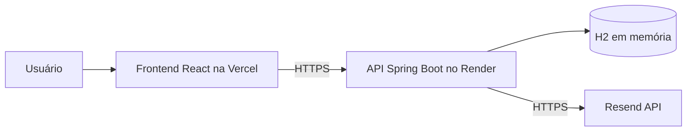

# Portfólio Profissional (Spring Boot + React)

## Links úteis
- Front-end (Vercel): _adicione aqui o link publicado_
- Back-end (Render): _adicione aqui o link publicado_

## Sobre o projeto
Aplicação de portfólio em monorepo com frontend React + Vite e backend Spring Boot. O objetivo é apresentar informações pessoais, projetos em timeline, experiências e contato com envio real de e-mail.

## Funcionalidades
- Navegação com 4 seções: Sobre Mim, Projetos, Experiências e Contato.
- Internacionalização PT/EN com troca em tempo real.
- Timeline de projetos ordenada do mais antigo ao mais recente.
- Consumo de API REST com estado de carregamento e fallback.
- Formulário de contato com validação no front e no back.
- Envio de e-mail via API Resend.

## Tecnologias
### Front-end
- React + Vite
- Mantine
- React Router
- i18next / react-i18next

### Back-end
- Java 25
- Spring Boot (Web, Data JPA, Validation)
- H2 em memória

## Arquitetura


Render no plano gratuito pode ter partida a frio após inatividade; por isso o frontend exibe mensagem de carregamento ao consultar a API.

## Instalação e execução
### Pré-requisitos
- Node.js LTS
- Java 25
- Maven 3.9+

### Front-end
```bash
cd frontend
cp .env.example .env.local
npm install
npm run dev
```

### Back-end
```bash
cd backend
cp .env.example .env
mvn spring-boot:run
```

## Variáveis de ambiente
### Backend (`backend/.env.example`)
| Variável | Descrição |
|---|---|
| `RESEND_API_KEY` | Chave da API do Resend |
| `CONTACT_TO_EMAIL` | E-mail que receberá as mensagens |
| `FRONTEND_URL` | URL do frontend para CORS |
| `PORT` | Porta da aplicação |

### Frontend (`frontend/.env.example`)
| Variável | Descrição |
|---|---|
| `VITE_API_URL` | URL da API com sufixo `/api` |

## Deploy
- Front-end: Vercel (Root Directory: `frontend`), com `frontend/vercel.json`.
- Back-end: Render (Docker, Root Directory: `backend`, Health Check: `/api/health`).

## Estrutura de pastas
```text
portfolio/
├── README.md
├── LICENSE
├── docs/
│   └── wireframes/
├── frontend/
└── backend/
```

## Demonstração
- Wireframes da S01: coloque os PNGs em `docs/wireframes/`.
- GIFs e prints dos projetos: adicione em `docs/` e `frontend/public/projects/`.

## Documentações
- React: https://react.dev
- Vite: https://vite.dev
- Spring Boot: https://spring.io/projects/spring-boot
- Resend: https://resend.com/docs

## Autores
- Arthur Augusto

## Licença
Distribuído sob licença MIT. Veja `LICENSE`.

## Agradecimentos
- Template e diretrizes da disciplina/Lab01.
- Repositório do professor como referência de estrutura e boas práticas.
